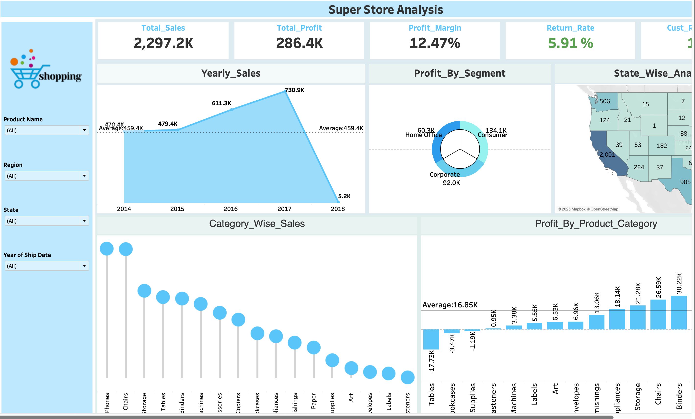

# 📊 Super Store Sales Analysis Dashboard

## 📝 Project Overview
This **Super Store Sales Analysis Dashboard** is built using **Tableau** to provide key insights into sales, profits, and customer segments. The dashboard helps in analyzing trends, identifying profitable product categories, and understanding regional sales performance.

## 📷 Dashboard Preview##   
Tableau Dashboard
Check out the interactive dashboard here: [Tableau Public Link](https://public.tableau.com/app/profile/karnan.k/viz/Super_Store_17411841294250/Dashboard1)

## 📂 Files Included
- **Super_Store.twbx** → Tableau Packaged Workbook  
- **Superstore.hyper** → Data Extract  
- **Super_Store_Dashboard.png** → Screenshot of the Dashboard  
- **README.md** → Project Documentation  

## 📊 Key Insights
1. **Total Sales:** $2,297.2K  
2. **Total Profit:** $286.4K  
3. **Profit Margin:** 12.47%  
4. **Return Rate:** 5.91%  
5. **Top Product Categories:** Phones, Chairs, Storage  
6. **Most Profitable Segments:** Consumer, Corporate, Home Office  
7. **State-wise Sales Analysis:** Highest in California  

## 🚀 How to Use the Dashboard
1. **Download Tableau Desktop or Tableau Public** (if not installed).  
2. Open **Super_Store.twbx** in Tableau.  
3. Explore filters (Product Name, Region, State, Year of Ship Date).  
4. Analyze different sections like Yearly Sales, Profit by Segment, and Category-wise Sales.  

## 📌 Technologies Used
- **Tableau** (for Data Visualization)  
- **Hyper Extracts** (for Data Processing)  

## 🤝 Contributing
Feel free to fork this repository, make improvements, and create a pull request.  

## 📩 Contact
For any queries, reach out via GitHub Issues.  

---
**⭐ If you like this project, don't forget to give it a star!**
